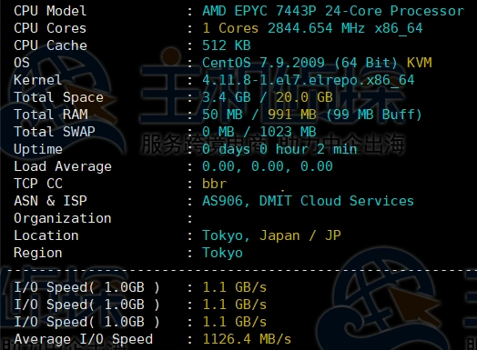
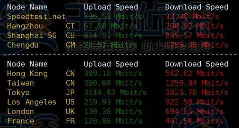
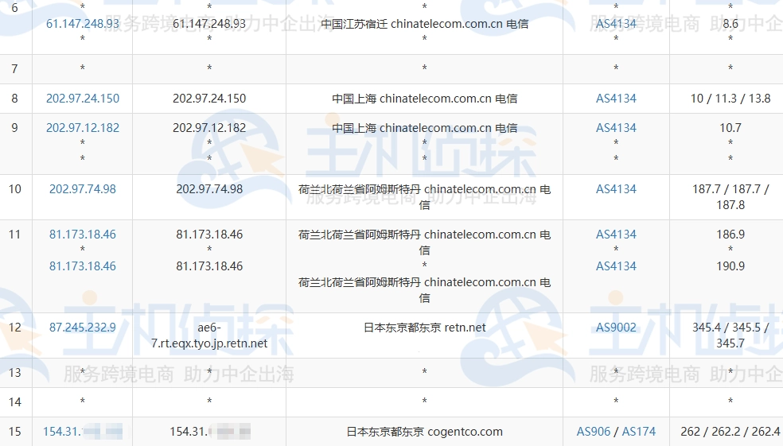
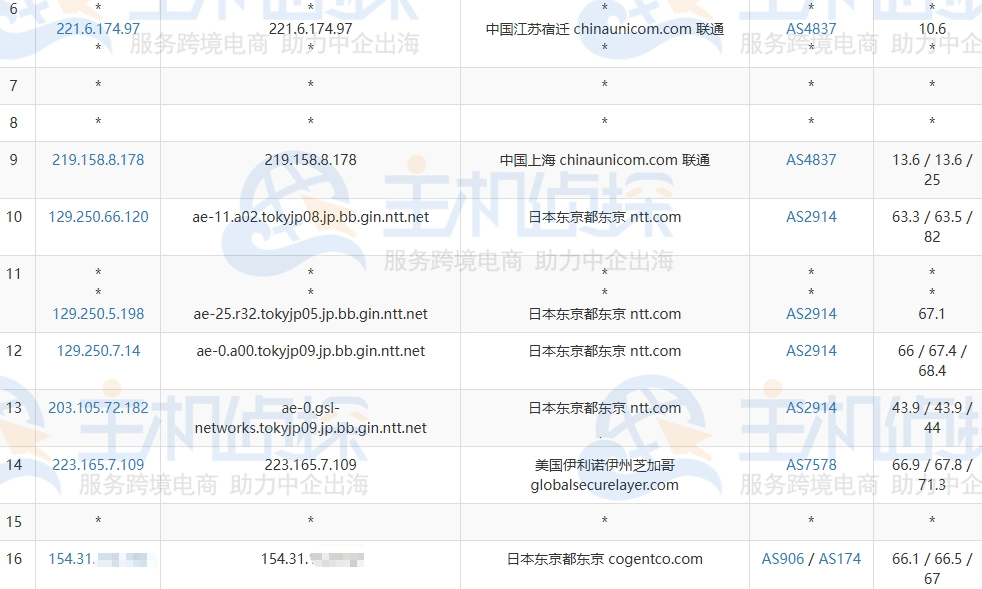
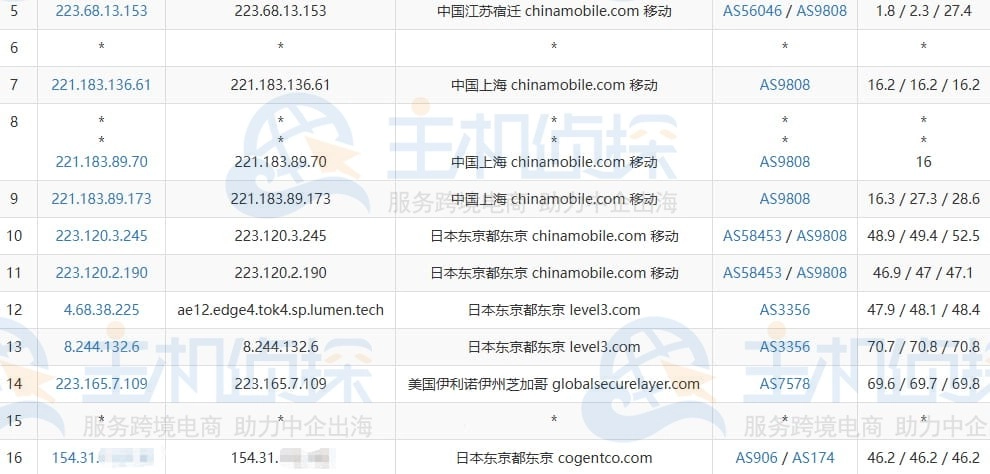
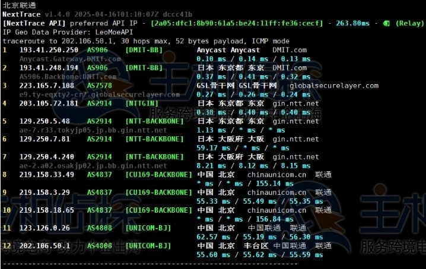
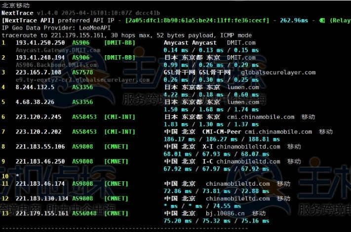
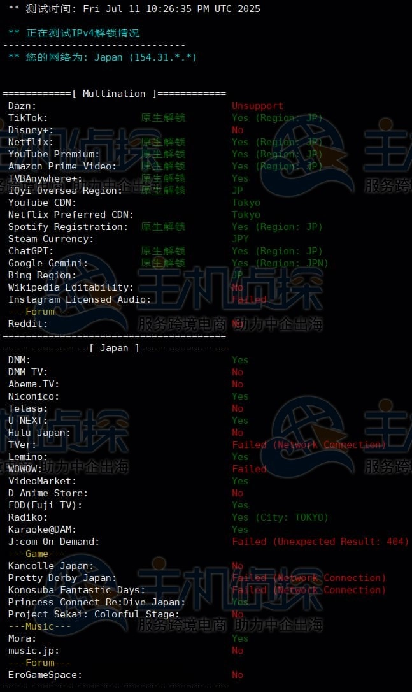
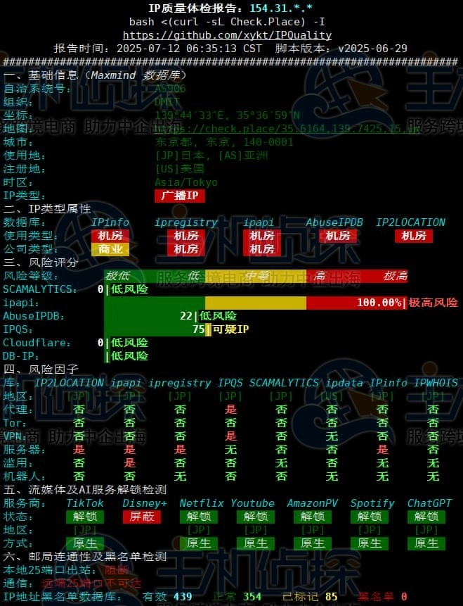
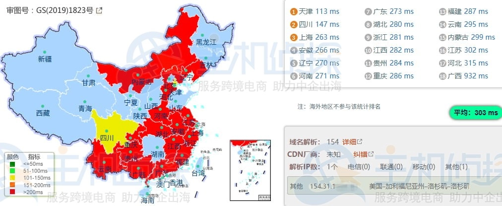

# DMIT日本T1系列VPS深度实测：国际线路能打吗?

你是不是也在找一台既能跑海外业务，又不想被线路问题折腾的日本VPS？市面上日本机房一大堆，但真正能稳定跑业务的没几个。今天拆解DMIT日本T1系列——走GSL国际网络的这款，看看它在真实场景下表现如何：硬件配置够不够硬？三网线路到底怎么走？延迟和带宽能不能满足你的需求？

---

## 测试机基本配置

这次测试的方案是：1核AMD EPYC 7443P、1G内存、20GB SSD、月流量2TB、带宽4Gbps、1个IPv4，月付6.9美元。价格不算便宜，但配置看着还行。

## 硬件性能：SSD读写破千兆

先看硬件底子。CPU是AMD EPYC 7443P，单核频率2.845GHz，这代EPYC处理器在企业级市场口碑不错。硬盘测试下来，平均读写速度达到1.1GB/s——这个速度对于跑数据库、文件操作来说完全够用，不会成为瓶颈。

## 带宽实测：标4G能跑多少?

账面上是4Gbps带宽，实测呢？日本本地节点上传下载都跑到3Gbps以上，基本榨干了带宽。但到国内和其他海外节点，速度就开始波动了——最慢200多Mbps，大多数时候稳定在500Mbps左右。这个表现说实话有点看运气，如果你的业务对稳定带宽要求高，得慎重考虑。

## 去程路由：三网表现差异大

**电信去程**绕了个大圈——先到荷兰再折回日本，延迟直接飙高。这种绕路对电信用户很不友好。

**联通去程**走NTT直连，延迟控制得不错，表现正常。

**移动去程**走AS9808 CMI线路直连，延迟也低。移动和联通用户在去程上占便宜。

## 回程路由：GSL网络直连回国

回程就统一多了，三网都主要走GSL网络直连回国。

**电信回程**通过GSL直连，比去程体验好太多。

**联通回程**同样GSL直连，延迟稳定。

**移动回程**部分走CMI，部分走GSL，但整体延迟都压得住。

如果你需要更稳定的回国线路，可以看看👉 [DMIT的其他优化线路方案](https://www.dmit.io/aff.php?aff=13832)，针对中国大陆访问做了专门优化。

## 原生IP和流媒体解锁

IP归属检测显示是日本原生IP，这点很重要——意味着可以解锁日本本地服务。

流媒体解锁测试：日本TikTok、日本Netflix、部分日区流媒体都能正常解锁。如果你是做内容分发或者需要访问日本本地服务，这个特性很加分。

## IP质量：普通机房IP

IP质量检测显示是标准的机房广播IP，25端口未开放（发邮件受限）。不是住宅IP，所以如果你的业务对IP纯净度要求特别高，这点需要注意。

## 延迟实测：平均303ms

Ping测试显示到国内平均延迟303ms——这个数字确实有点高。对比其他日本VPS普遍100-150ms的延迟，这个表现不算理想。如果你跑实时性要求高的应用（比如游戏服务器、实时通信），可能会感觉到明显卡顿。

但如果是跑网站、API服务、数据抓取这类对延迟不那么敏感的业务，300ms其实还能接受。

---

## 总结：适合谁用?

测试下来，DMIT日本T1系列有明显的优缺点：

**优势：**
- 硬件性能扎实，SSD读写速度快
- 日本原生IP，能解锁本地流媒体
- 联通和移动用户体验相对友好
- 回程GSL直连，比去程稳定

**劣势：**
- 电信去程绕路严重，延迟高
- 整体平均延迟303ms，不适合实时性业务
- 带宽波动较大，到国内速度不够稳定

如果你主要跑海外业务、需要日本原生IP、对延迟要求不苛刻，这款还算能打。但如果你是电信用户，或者需要超低延迟，建议看看👉 [DMIT的CN2 GIA优化线路方案](https://www.dmit.io/aff.php?aff=13832)，针对中国大陆用户做了专门优化，延迟和稳定性都要好很多。
